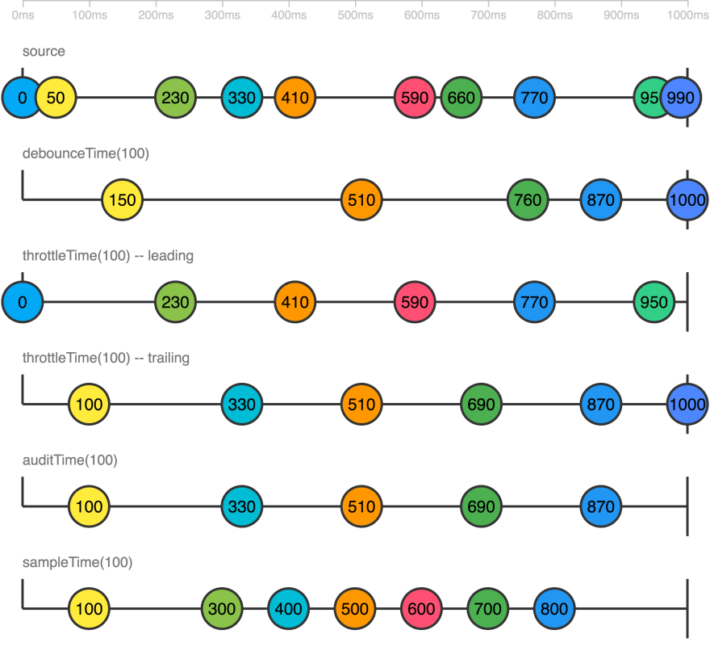

# Angular100Doc

## DAY #2 - EXPLORE APP

- `<app-root>` inside index.html
- module
- ngModule - angular component
- a component can be declared in only one module/place

## DAY #3 - DATA BINDING

- interpolation: `{{ data }}`
- property binding: `[value]="data.value"`
- event binding: `(click)="handleClick()"`
- 2 way binding: `[(ngModel)]="data.value" // FormsModule needed`

## DAY #4 - STRUCTURE DIRECTIVE - NGIF

- if else: `<div *ngIf="data === condition; else someTag" >`
- ng-template:

```typescript
    <ng-template #someTag>
    <ng-templage [ngIf]="data == condition">
```

## DAY #5 - STRUCTURE DIRECTIVE - NGFOROF

- `<div *ngFor="let author of authors; idx as index">`
- local variables: \$implicit: T; index; count; first; last; even; odd
- `<ng-template ngFor [ngForOf]="authors" let-author let-idx="index">`

- multiple structure directive:

```HTML
    <div *ngFor="”let" item of list”>
        <div *ngIf="”somethingGoood”">
            More code
        </div>
    </div>
```

```HTML
    <div *ngFor="”let" item of list”>
        <ng-container *ngIf="”somethingGoood”">
            More code
        </ng-container>
    </div>
    <div *ngFor="”let" item of list”>
        <ng-template [ngIf]="”somethingGoood”">
            More code
        </ng-template>
    </div>
```

## DAY #6 - ATTRIBUTE DIRECTIVE

- class binding: `<div [class.tab-active]="isTabActive">`, `[class]="clasExpr"` with classExpr is string, array string, object
- style binding: `<div [style.width]="'value'">`
  with unit: `[style.property.unit]="expression"` with expression is `number | undefined | null`
  `[style]="styleExpr"` with styleExpr is string, array string, object
- font-size & fontSize are both acceptable

## DAY #7 - COMPONENT INTERACTION

- ngOnInit: run after component is created, after constructor and input binding
- validate in ngOnChanges or setter/getter; ngOnChanges is better for multiple input validation
- ngOnChanges can access to both old & new value
- have to implement onChanges & override ngOnChanges when using ngOnChanges
- dynamically component generating: manually call lifecycle → implement side effect in setter
- `<button (click)="currentProgress = currentProgress + 1">increase</button>`
- external name/alias is not recommended

## DAY #8 - COMPONENT INTERACTION - PARENT LISTENS TO CHILDREN EVENT

- create: `@Output() delete = new EventEmitter<number>();`
- emit: `(click)="delete.emit(author.id):`
- implement handling method: `onDelete(id: number) { //somethimg }`
- binding: `(delete)="onDelete($event)`

## DAY #9 - CUSTOM 2 WAY BINDING

- 2 way binding: `<input type="text" [(ngModel)]="name">` === `<input type="text" [ngModel]="name" (ngModelChange)="name = $event">`
- create input & output:

```typescript
    @Input() checked: boolean;
    @Output() checkedChange = new EventEmitter<boolean>(); // must have `change` suffix
    [(checked)]="isChecked"
```

## DAY #10 - TEMPLATE VARIABLE, VIEWCHILD, VIEWCHILDREN

- template variable:

```HTML
<button (click)="toggleComp.toggle()"></button>
<app-toggle #toggleComp></app-toggle>

```

```typescript
ViewChild(selector: string | Function | Type<any>, opts?: {
  read?: any;
  static?: boolean;
})
```

```typescript
@ViewChildren(ToggleComponent) toggleList: QueryList<ToggleComponent>;


ngAfterViewInit() {
  console.log(this.toggleList);
}
```

- `static` grants access of component in ngOnInit; however, childComponent must not be in any structure directive
- `ViewChildren` subscribe changes will fail if a child is inside a structure directive; in that case, move method to ngAfterViewInit
- `ViewChildren` does not have `static`

## DAY #11 - TYPESCRIPT DATA TYPE

- `interface` is used to define types for an object

```typescript
interface User {
  firstName: string;
  lastName: string;
  age: number;
  job?: string; // optional property
}
```

```typescript
type User = {
  firstName: string;
  lastName: string;
  age: number;
  job?: string;
};
```

## DAY #12 - TYPESCRIPT ADVANCED TYPE

- `unknown` is recommended instead of `any`
- Union type: A or B
  `function test () string | number {}`
  `type StringOrNumber = string | number;`
- Intersection type A and B

```typescript
function merge<T1, T2>(o1: T1, o2: T2): T1 & T2 {
  return { ...o1, ...o2 };
}

merge({ foo: "bar" }, { bar: "foo" });
```

- Conditional type: `T extends U ? X : Y`
- Type alias

```typescript
@Component({
  selector: "flex-container",
  template: `<ng-content></ng-content>`,
})
export class FlexComponent {
  @Input() flexDirection: string = "row";

  @HostBinding("style.display") get display() {
    return "flex";
  }

  @HostBinding("style.flex-direction") get direction() {
    return this.flexDirection;
  }
}
```

- Alternative:

```typescript
    type FlexDirection = 'row' | 'column' | 'row-reverse' | 'column-reverse';

    @Component({
    selector: 'flex-container',
    template: `<ng-content></ng-content>`
    })
    export class FlexComponent {
    @Input() flexDirection: FlexDirection = 'row';

    @HostBinding('style.display') get display() {...}

    @HostBinding('style.flex-direction') get direction() {
        return this.flexDirection;
    }
    }
```

```HTML
    <!-- app.component.html -->
    <flex-container>
    <button>Submit</button>
    <button>Cancel</button>
    </flex-container>

    <flex-container flexDirection="column">
    <input type="email" />
    <input type="password" />
    </flex-container>
```

- Type alias + conditional type

```typescript
type ObjectDictionary<T> = { [key: string]: T };
type ArrayDictionary<T> = { [key: string]: T[] };
export type Dictionary<T> = T extends []
  ? ArrayDictionary<T[number]>
  : ObjectDictionary<T>;

type StringDictionary = Dictionary<string>; // {[key: string]: string}
type NumberArrayDictionary = Dictionary<number[]>; // {[key: string]: number[]}
type UserEntity = Dictionary<User>; // {[key: string]: User}
```

## DAY #13 - CONTENT PROJECTION

- `<ng-content></ng-content>` work the same as React's `{children}`
- multiple `ng-content` is not allowed (without selector)
- Tag selector: `<ng-content select="some-component-selector-or-html-tag"><ng-content>`
- CSS class selector: `<ng-content select=".some-class"></ng-content>`
- Attribute selector: `<ng-content select="[some-attr]"></ng-content>`
- Selectors combination: `<ng-content select="some-component-selector-or-html-tag[some-attr]"></ng-content>`
- Selector: the same as CSS selector `select="label, span, app-label"`
- ngProjectAs: `<span ngProjectAs="label">` `<ng-container ngProjectAs="label">`
- `ng-container` works the same as React `<>`

## DAY #14 - `NG-TEMPLATE`, `NGTEMPLATEOUTLET` AND `NG-CONTAINER`

- `ng-template`: a template that render with some conditions
- `ng-container`: avoid unnecessary wrapper

```HTML
<ng-container [ngTemplateOutlet]="counterTmpl"></ng-container> items.
<ng-template #counterTmpl>
<span class="badge badge-primary">{{ counter }}</span> items
</ng-template>
```

```HTML
<ng-container
    *ngTemplateOutlet="linkTemplate; context: { $implicit: link }"
    *ngTemplateOutlet="linkTemplate; context: { link: link }"
>
    <!-- <ng-container
    [ngTemplateOutlet]="linkTemplate"
    [ngTemplateOutletContext]="{ link: link }"
> -->
</ng-container>
```

```HTML
<ng-template #linkTemplate let-l>
<!-- <ng-template #linkTemplate let-l="link"> -->
<h4>
{{l}}
</h4>
</ng-template>
```

## DAY #15 - DEPENDENCY INJECTION

- `@Injectable()`, `NgModule()`, `@Component()`

```typescript
@Injectable({
  providedIn: "root",
})
export class CartService {
  // properties and methods
}
```

```typescript
@Component({
  selector: "app-product",
  templateUrl: "./product.component.html",
  styleUrls: ["./product.component.css"],
})
export class ProductComponent implements OnInit {
  constructor(private cartService: CartService) {}

  ngOnInit() {
    console.log(this.cartService.calculateTotal());
  }
}
```

## DAY #16 - DEPENDENCY INJECTION IN ANGULAR

- Inject parent component to child component
- Provide another component with the same API

```typescript
@Component({
  selector: "app-bs-tab-group",
  templateUrl: "./bs-tab-group.component.html",
  styleUrls: ["./bs-tab-group.component.css"],
  providers: [
    {
      provide: TabGroupComponent,
      useExisting: BsTabGroupComponent,
    },
  ],
})
export class BsTabGroupComponent extends TabGroupComponent {}
```

- Forward reference

```typescript
const BsTabGroupProvider = {
  provide: TabGroupComponent,
  useExisting: forwardRef(() => BsTabGroupComponent),
};

@Component({
  selector: "app-bs-tab-group",
  templateUrl: "./bs-tab-group.component.html",
  styleUrls: ["./bs-tab-group.component.css"],
  providers: [BsTabGroupProvider],
})
export class BsTabGroupComponent extends TabGroupComponent {}
```

- Provider syntax
  `useClass`

```typescript
@NgModule({
  providers: [SomeClass]
})
```

```typescript
@NgModule({
  providers: [{ provide: SomeClass, useClass: SomeClass}]
})
```

`useExisting`

```typescript
@Component({
  providers: [
    {
      provide: SomeClass,
      useExisting: OtherClass
    }
  ]
})
```

`useFactory`

```typescript
@Component({
  providers: [
    {
      provide: SomeClass,
      useFactory: function() {
        return aValue;
      }
    }
  ]
})
```

`useValue`

```typescript
@Component({
  providers: [
    {
      provide: SomeToken,
      useValue: someValue
    }
  ]
})
```

## DAY #17 - `CONTENTTYPE` AND `CONTENTCHILDREN` IN ANGULAR

- `@Component` is just `@Directive` with template

- `ContentChild` can be used to lazy load component

`@ContentChild(TabContentDirective, { static: true, read: TemplateRef }) explicitBody: TemplateRef<unknown>;`

- `@ContentChildren`:

`@ContentChildren(forwardRef(() => TabPanelComponent)) tabPanels: QueryList<TabPanelComponent>;`

- `forwardRef()` can be used to resolve `cannot access Component before initialization

- `@ViewChildren`: your own child; `@ContentChildren`: someone's else child

- `View`: template that component directly interact with (crud). It is everything inside `templateUrl` or `template` of `@Component`, 
except for `ng-content`. A component's view is a black box for other components (shadow DOM)

- `Content`: template that is projected inside component/directive tag (light DOM)

## DAY #18 - PIPE

- `{{ interpolated_value | pipe_name }}`

- Pipe parameter: `{{ value | pipe: param1:param2 }}`

- Pipe chaining: `{{ value | pipe1 | pipe2 }}`

- Custom pipe:

  create `class implements interface PipeTransform`

  ```typescript
  interface PipeTransform {
    transform(value: any, ...arge: any[]: any);
  }
  ```

  ```typescript
  export class AppTitlePipe implements PipeTransform {
    transform(resourceId: string): string {
      return resourceId ? "Edit" : "Add";
    }
  }
  ```

  Add pipe decorator

  ```typescript
  @Pipe({
    name: 'Title'; //required
  })

  export class AppTitlePipe implements PipeTransform {
    ...
  }
  ```

```HTML
<h2 class='ibox-title'>{{ userId | appTitle }}</h2>
```

Custom pipe parameters

```typescript
transform(
  resourceId: string,
  addText: string = 'Add',
  editText: string = 'Edit',
): string {
  return resourceId ? editText : addText;
}
```

```HTML
{{ userId | appTitle: 'Set': 'Change }}
```

- Detect changes with data binding in pipes

Primitive type

```typescript
export class PipeExampleComponent implements OnInit {
  userIdChangeAfterFiveSeconds = "14324";
  time$: Observable<number> = timer(0, 1000).pipe(
    map((val) => 5 - (val + 1)),
    startWith(5),
    finalize(() => {
      this.userIdChangeAfterFiveSeconds = "";
    }),
    takeWhile((val) => val >= 0)
  );
}
```

```HTML
<p>
  Set userId to empty string after {{ timer | async }} seconds, notice the text "Edit" will be set to "Add"
</p>
<pre ngNonBindable>{{ userIdChangeAfterFiveSeconds | appTitle }}</pre>
<div>Form title: {{ userIdChangeAfterFiveSeconds | appTitle }} User</div>
```

Reference type
`pipe` cannot detect change in reference type, use `immutable` method or `pure:false`

```typescript
@Pipe({
  name: "isAdult",
  // pure: false,
})
export class IsAdultPipe implements PipeTransform {
  transform(arr: User[]): User[] {
    return arr.filter((x) => x.age > 18);
  }
}
```

```HTML
<div class="row">
  <div class="col-xs-6">
    <h4>Full user list</h4>
    <div *ngFor="let user of users">{{ user.name }}</div>
  </div>
  <div class="col-xs-6">
    <div class="ml-4">
      <h4>Adult user list</h4>
      <div *ngFor="let user of users | isAdult">{{ user.name }}</div>
    </div>
  </div>
</div>
```

- `*ngFor="let user of users | pipeName"`
- nested pipe in pipe

```typescript
export class AdultPipe implements PipeTransform {
  transform(value, pipe) {
    pipe.transform();
    return value.filter((x) => x.age >= 18);
  }
}
```

## DAY #19 - RX OBSERVABLE CONCEPTS

- `Observable`:
  A collection of values or events in the future. Values and events created in the future will be passed to `Observer`
  `Observable` is a function which take an `Observer` and return a function to cancel execution (`unsubscribe`)

- `Observer`:
  A collection of callbacks to listen to values sent from `Observable`

- `Subscription`:
  Result after a `Observable` is resolved, have a `unsubscribe` to resolve stream

- `Operators`:
  Pure functions/methods to use with `Observable`

- `Subject`:
  Send data to multiple `Observers` (multicasting)

- `Scheduler`:
  Control when a `subscription` start, when to send message

- Create `Observable`:

  ```typescript
  const observable = new Observable(function subscribe(observer) {
    // done creating observable
    const id = setTimeout(() => {
      observer.next("hello rxjs");
      observer.complete();
    }, 1000);
    return function unsubscribe() {
      //cleanup
      clearTimeout(id);
    };
  });
  ```

- Invoke `Observable`:
  `subscribe` to invoke, a `Subscription` is returned

  ```typescript
  const subsription = observable.subscribe({
    next: (value) => {
      console.log(value);
    },
    error: (err) => {
      console.error(err);
    },
    complete: () => {
      console.log("done");
    },
  });
  ```

- Execute `Observable`:
  `new Observable(function subscribe(observer)) {...}`
  Notification:
  `next`: send a value, `number`, `string`, `object`, etc
  `error`: send a javascript error or exception
  `complete`: send no value but send a message instead, to notify that the stream is completed in order for `Observer` to execute some actions
  Either `error` or `complete` can be sent once

- Dispose `Observable` execution:

  ```typescript
  const subscription = observable.subscribe({
    next: (value) => {
      console.log(value);
    },
    error: (error) => {
      console.log(error);
    },
    complete: () => {
      console.log("Done");
    },
  });

  setTimeout(() => {
    subscription.unsubscribe();
  }, 500);
  ```

- `Observer`:
  Consumes data sent from `Observable`. `Observer` consists of 3 callbacks respectively for each notification: `next`, `error`, `complete`

  ```typescript
  const observer = {
    next: (x) => console.log("Observer got a next value: " + x),
    error: (err) => console.error("Observer got an error: " + err),
    complete: () => console.log("Observer got a complete notification"),
  };
  ```

  ```typescript
  observable.subscribe(
    (x) => console.log("Observer got a next value: " + x),
    (err) => console.error("Observer got an error: " + err),
    () => console.log("Observer got a complete notification")
  );
  ```

  ```typescript
  const observer = {
    next: (x) => console.log("Observer got a next value: " + x),
    error: (err) => console.error("Observer got an error: " + err),
    complete: () => console.log("Observer got a complete notification"),
  };
  ```

  ```typescript
  observable.subscribe(
    (x) => console.log("Observer got a next value: " + x),
    null,
    () => console.log("Observer got a complete notification")
  );
  ```

- `Subscription`:
  Cancel `Observable` execution

  ```typescript
  const foo = interval(500);
  const bar = interval(700);

  const subscription = foo.subscribe((x) => console.log("first: " + x));
  const childSub = bar.subscribe(x => console.log('second: ' + x));

  subscription.add(childSub);

  setTimeout(() => {
    // Unsubscribes BOTH `subscription` and `childSub`
    subscription.unsubscribe();
  }, 2000);

  ngOnDestroy() {
    subscription.unsubscribe();
  }
  ```

## DAY #20 - RXJS CREATION

- `of()`:
  create `Observable` from any value: `primitive`, `array`, `object`, `function`,...
  `of()` receives, returns the values and `complete` right away as soon as all the value are `emitted`

  Primitive value

  ```typescript
  // output: 'hello'
  // complete: 'complete'
  of("hello").subscribe(observer);
  ```

  Object/Array

  ```typescript
  // output: [1, 2, 3]
  // complete: 'complete'
  of([1, 2, 3]).subscribe(observer);
  ```

  Sequence of values

  ```typescript
  // output: 1, 2, 3, 'hello', 'world', {foo: 'bar'}, [4, 5, 6]
  // complete: 'complete'
  of(1, 2, 3, "hello", "world", { foo: "bar" }, [4, 5, 6]).subscribe(observer);
  ```

- `from()`:
  create `Observable` from: `Iterable` or `Promise`

  Array

  ```typescript
  // output: 1, 2, 3
  // complete: 'complete'
  from([1, 2, 3]).subscribe(observer);
  ```

  String

  ```typescript
  // output: 'h', 'e', 'l', 'l', 'o', ' ', 'w', 'o', 'r', 'l', 'd'
  // complete: 'complete'
  from("hello world").subscribe(observer);
  ```

  Map/Set

  ```typescript
  const map = new Map();
  map.set(1, "hello");
  map.set(2, "bye");

  // output: [1, 'hello'], [2, 'bye']
  // complete: 'complete'
  from(map).subscribe(observer);

  const set = new Set();
  set.add(1);
  set.add(2);

  // output: 1, 2
  // complete: 'complete'
  from(set).subscribe(observer);
  ```

  Promise

  ```typescript
  // output: 'hello world'
  // complete: 'complete'
  from(Promise.resolve("hello world")).subscribe(observer);
  ```
  `from()` returns each item of `Iterable`
  `from()` unwrapps and returns resolved value of `Promise`. This is a way of converting a `Promise` into an `Observable`

- `fromEvent()`
  Used to convert an event into an `Observable`

  ```typescript
  const btn = document.querySelector("#btn");
  const input = document.querySelector("#input");

  // output (example): MouseEvent {...}
  // complete: không có gì log.
  fromEvent(btn, "click").subscribe(observer);

  // output (example): KeyboardEvent {...}
  // complete: không có gì log.
  fromEvent(input, "keydown").subscribe(observer);
  ```

  `fromEvent()` creates an `Observable` without automatically implement `complete`. Manually invoke `unsubscribe` is needed

- `fromEventPattern()`

  `fromEventPattern()` is different from `fromEvent()` in terms of usage and event type

  ```typescript
  // fromEvent() từ ví dụ trên
  // output: MouseEvent {...}
  fromEvent(btn, "click").subscribe(observer);

  // fromEventPattern
  // output: MouseEvent {...}
  fromEventPattern(
    (handler) => {
      btn.addEventListener("click", handler);
    },
    (handler) => {
      btn.removeEventListener("click", handler);
    }
  ).subscribe(observer);
  ```

  ```typescript
  // output: 10 10
  fromEvent(btn, "click")
    .pipe(map((ev: MouseEvent) => ev.offsetX + " " + ev.offsetY))
    .subscribe(observer);

  // fromEventPattern
  // Ở ví dụ này, chúng ta sẽ tách `addHandler` và `removeHandler` ra thành function riêng nhé

  function addHandler(handler) {
    btn.addEventListener("click", handler);
  }

  function removeHandler(handler) {
    btn.removeEventListener("click", handler);
  }

  // output: 10 10
  fromEventPattern(
    addHandler,
    removeHandler,
    (ev: MouseEvent) => ev.offsetX + " " + ev.offsetY
  ).subscribe(observer);
  ```

`fromEventPattern()`receives 3 parameters: add..., remove... and `projectFunc`(optional)
`fromEventPattern()` provides API to transform event from original API of the event
`addEventListener`and `removeEventListener`APIs are used directly from the DOM to transform into `Observable`. 
`fromtEventPattern()`can be used to transform more complicated API into `Observable`, such as `SignalR Hub`

  ```typescript
// _getHub() là hàm trả về Hub.
const hub = this._getHub(url);
return fromEventPattern(
  (handler) => {
    // mở websocket
    hub.connection.on(methodName, handler);

    if (hub.refCount === 0) {
      hub.connection.start();
    }

    hub.refCount++;
  },
  (handler) => {
    hub.refCount--;
    // đóng websocket khi unsubscribe
    hub.connection.off(methodName, handler);
    if (hub.refCount === 0) {
      hub.connection.stop();
      delete this._hubs[url];
    }
  }
);  // _getHub() returns Hub
  const hub = this._getHub(url);
  return fromEventPattern(
    (handler) => {
      // open websocket
      hub.connection.on(methodName, handler);

      if (hub.refCount === 0) {
        hub.connection.start();
      }

      hub.refCount++;
    },
    (handler) => {
      hub.refCount--;
      // close websocket on unsubscribe
      hub.connection.off(methodName, handler);
      if (hub.refCount === 0);
      delete this._hub[url];
    }
  );
```

- `interval(timeInterval)`
`interval()` is a function to create `Observable` which emit interger from 0 to 1 occasionally, alike `setInterval`

  ```typescript
  // output: 0, 1, 2, 3, 4, ...
  interval(1000) // emit each second
    .subscribe(observer);
  ```

Like `fromtEvent()`, `interval()`does not implicitly implement `complete`, this needs to be handled manually

- `timer()`
`timer()`can be used in 2 ways:
  - `timer(timeInterval)` create `Observable` which emits value after a period time. This will auto implement `complete`
  - `timer(timeInterval, periodInterval)` create `Observable` which emits value after a period time and emits value after each cycle/run. 
  This way of use is similar to `interval()`, however, `timer()` supports delaying before `emit`. This will not auto `complete`

  ```typescript
  // output: after 1 sec → 0
  // complete: 'complete'
  timer(1000).subscribe(observer);

  // output: after 1 sec → 0, 1, 2, 3, 4, 5,...
  timer(1000, 1000).subscribe(observer);

- `throwError()` (`catchAndRethrow`)
  `throwError()` is used to create `Observable`which instead of `emit` value, throw an error after `subscribe`

  ```typescript
  // error: 'an error'
  throwError('an error').subscribe(observer);
  ```

  `throwError()` is commonly used in error handling of an `Observable`, after handling the error, we want to throw error to the next `ErrorHandler`
  When working with `Observable`, there will be `operators`which requires you to provide an `Observable` (`switchMap`, `catchError`), 
  using `throwError`will be a wise choice

- `defer()`
  `defer()` receives an `Observablefactory`and returns this `Observable`. `defer()` will use this `ObservableFactory` to create a new `Observable` for each `subscriber`

  ```typescript
  // of()
  const now$ = of(Math.random());
  // output: 0.4146530439875191
  now$.subscribe(observer);
  // output: 0.4146530439875191
  now$.subscribe(observer);
  // output: 0.4146530439875191
  now$.subscribe(observer);// of()
    const now$ = of(Math.random());
    // output: 0.456498
  ```

  `of()` returns the same value in all 3 times

  ```typescript
  const now$ = defer(() => of(Math.random()));
  // output: 0.27312186273281935
  now$.subscribe(observer);
  // output: 0.7180321390218474
  now$.subscribe(observer);
  // output: 0.9626312890837065
  now$.subscribe(observer);const now$ = defer(() => of(Math.random()))
  ```

  `defer()` returns different values for each `subscribe`
  Get lazy evaluate, run whenever `.subscribe`, `of` runs and create new `Observable`, `Math.random` runs and create new value
  `defer()` (combine with `retry`) will be the solution when we need to `retry` an `Observable` which need to compare with a random value

## Day #21 RX TRANSFORMATION

Creator operators can be called as normal function. `Pipeable` operators will be called inside `pipe()` method of an `Observable` instance.
-   `Pipeable` operators:
    -   Pure functions that receive an `Observable` and return another `Observable`.
    -   Incoming `Observable` will not be mutated.
    -   Syntax: 
    
    ```typescript
    observableInstance.pipe(
        operator1(),
        operator2()
    )
    ```
    
    -   `observableInstance` will always return another `Observable` regardless the number of executed `pipeable` operator. 
    Hence, reassign or resubscribe is needed:
    
    ```typescript
    const returnedObservable = observableInstance.pipe(
        operator1(),
        operator2(),
    )   
    ``` 
    
    -   `Transformation` operator is one category of `Pipeable` operators.
    
-   `Transformation` operators
    -   The same as JS `map`, `filter`

    ```typescript
    import { Observable } from 'rxjs'; 

    interface User {
        id: string;
        username: string;
        firstname: string;
        lastname: string;
    }

    const source = new Observable<User>((observer) => {
        const users = [
            {id: 'ddfe3653-1569-4f2f-b57f-bf9bae542662', username: 'tiepphan', firstname: 'tiep', lastname: 'phan'},
            {id: '34784716-019b-4868-86cd-02287e49c2d3', username: 'nartc', firstname: 'chau', lastname: 'tran'},
        ];

    setTimeout(() => {
        observer.next(users[0]);
    }, 1000);
    setTimeout(() => {
        observer.next(users[1]);
        observer.complete();
    }, 3000);
    });

    const observer = {
        next: value => console.log(value),
        error: err => console.error(err),
        complete: () => console.log('completed'),
    };
    source.subscribe(observer);
    ```

    -   `map`
    
    `map<T, R>(project: (value: T, index: number) => R, thisArg?: any): OperatorFunction<T, R>`
     
    -   To display user's full name inside `next`, we can `transform` data along the way.
    -   Always receive outer/parent `observable` or the previous `observable`
    -   Will not loop through every item of a list (use `from` instead of  `of` to do so)
    
    ```typescript
    import { map } from 'rxjs/operator';
    
    source.pipe(
        map(user => {
            return {
            ...user,
            fullName: `${user.firstname} ${user.lastname}`
            };
        })
    ).subscribe(observer);
    ```
    
    -   Or, to return user's id upon emitting.
    
    ```typescript
        source.pipe(
            map(user => user.id)
        ).subscribe(observer);
    ```
    
    -   `pluck`
    
        -    `pluck<T, R>(...properties: string[]): OperatorFunction<T, R>`
    
        -   pluck an attribute from the received data (key from object, item index from array, nested object)
    
    -   `mapTo`
    
        -   `mapTo<T, R>(value: R): OperatorFuntion<T, R>`
    
        -   use `mapTo` to implement mouse hover event, return `true` on `mouseover`, return `false` on `mouseleave`.
    
        ```typescript
        const element = document.querySelector('#hover');
    
        const mouseover$ = fromEvent(element, 'mouseover');
        const mouseleave$ = fromEvent(element, 'mouseleave');
    
        const hover$ = merge(
            mouseover$.pipe(
                mapTo(true),
            ),
            mouseleave$.pipe(
                mapTo(false),
            )
        );
    
        hover$.subscribe(observer);
        ```
    
    -   `scan`
    
        -   `scan<T, R>(accumulator: (acc: R, value: T, index: number) => R, seed?: T | R): OperatorFunction<T, R>`
    
        ```typescript
        const button = document.querySelector('#add');
    
        const click$ = fromEvent(button, 'click');
    
        click$.pipe(
            scan((acc, curr) => acc + 1, 0)
        ).subscribe(observer);
        ```
    
        ```typescript
        const users$ = new Observable<User>((observer) => {    
            const users = [
                {id: 'ddfe3653-1569-4f2f-b57f-bf9bae542662', username: 'tiepphan', firstname: 'tiep', lastname: 'phan', postCount: 5},
             {id: '34784716-019b-4868-86cd-02287e49c2d3', username: 'nartc', firstname: 'chau', lastname: 'tran', postCount: 22},
            ];
    
            setTimeout(() => {
                observer.next(users[0]);
            }, 1000);
            setTimeout(() => {
                observer.next(users[1]);
                observer.complete();
            }, 3000);
            });
    
        users$.pipe(
            scan((acc, curr) => acc + curr.postCount, 0)
        ).subscribe(observer);
        ```
    
    -   `reduce`
    
        -    `reduce<T, R>(accumulator: (acc: T | R, value: T, index?: number) => T | R, seed?: T | R): OperatorFunction<T, T | R>`
        -   `reduce` will reduce the value overtime, but it will wait until source completes then emit the value
        -   reduce only run whenever the `observale` completes, won't run with interval (`observable` does not complete)
    
        ```typescript
        users$.pipe(
            reduce((acc, curr) => acc + curr.postCount, 0)
        ).subscribe(observer);
        ```

    -   `toArray`
        -   `toArray<T>(): OperatorFunction<T, T[]>`
        -   `toArray` collects emitted values from the stream to combine an array then emits the array when the stream complete.
    
        ```typescript
        users$.pipe(
            reduce((acc, curr) => [...acc, curr], [])
        ).subscribe(observer);
        ```
    
        ```typescript
        users$.pipe(
            toArray()
        ).subscribe(observer);
        ```
    
    -   `buffer`
    
        -   `buffer<T>(closingNotifier: Observable<any>): OperatorFunction<T, T[]>`
        -   `buffer` saves emitted values and wait until `closingNotifier` to emit the values as an arrray
        -   `buffer` only run under condition (not really sure about the words)
        -   `observable` will still run under the hood, whenever `buffer` run, it emits all values accumulated before

        ```typescript
        const interval$ = interval(1000);
    
        const click$ = fromEvent(document, 'click');
    
        const buffer$ = interval$.pipe(
            buffer(click$)
        );
    
    
        const subscribe = buffer$.subscribe(
            val => console.log('Buffered Values: ', val)
        );
    
        // output có dạng
        "Buffered Values: "
        [0, 1]
        "Buffered Values: "
        [2, 3, 4, 5, 6]
        ```
    
    -   `bufferTime`
    
        -   `bufferTime<T>(bufferTimeSpan: number): OperatorFunction<T, T[]>`
    
        -   Work the same as `buffer`, but emit value every `bufferTimeSpan` ms
    
        ```typescript
        const source = interval(500);

        const bufferTime = source.pipe(
            bufferTime(2000)
        );

        const bufferTimeSub = bufferTime.subscribe(
            val => console.log('Buffered with Time:', val)
        );
        // output
        "Buffered with Time:"
        [0, 1]
        "Buffered with Time:"
        [2, 3]
        "Buffered with Time:"
        [4, 5]
        ...
        ```
## Day #22 RXJS Filtering Operators

-   `filter()`

    -   `filter<T>(predicate: (value: T, index: number) => boolean, thisArg?: any) : MonoTypeOperationFunction<T>`
    -   `filter()` takes a function `predicate` which returns `truthy` or `falsy` value. `filter()` will emit the value 
    of the `Observable` at that time, depending on the `truthy/falsy` value.
    
    ```typescript
    from([1, 2, 3, 4, 5, 6])
        .pipe(
            filter(x => x % 2 === 0)
        )
        .subscribe(console.log); // output: 2, 4, 6
    ```
    
-   `first()`

    -   `first<T, D>(predicate?: (value: T, index: number, source: Observable<T>) => boolean, defaultValue?: D): OperatorFunction<T, T | D>`
    -   `first()` emits the first value of the `Observable`, then `complete`. `first()` will throw `EmptyError` 
    if the `Observable` `complete` before emitting any value (empty `Observable`, or creator operation which take no value)
    
    ```typescript
    from([1, 2, 3, 4, 5, 6])
        .pipe(
            first()
        )
        .subscribe(console.log, null, () => console.log('complete')); // output: 1 -> complete
    
    of() // empty observable
    .pipe(
        first()
    )
    .subscribe(console.log) // output: Error: EmptyError
    ```
    
    -   `first()` can take 2 optional parameters: `predicate` and `defaultValue`. `first()` will throw `Error` 
    if the `Observable` complete without having any value satisfy the condition from the `predicate`
    -   `first()` will not emit `Error` when we pass both `predicate` and `defaultValue`
    
    ```typescript
    from([1, 2, 3, 4, 5, 6])
        .pipe(
            first(x => x > 3)
        )
        .subscribe(console.log, null, () => console.log('complete')); // output: 4 -> complete
    
    from([1, 2, 3, 4, 5, 6])
        .pipe(
            first(x => x > 6) // without default value
        )
        .subscribe(null, console.log, null) // Error: Error
    
    from([1, 2, 3, 4, 5, 6])
        .pipe(
            first(x => x > 6),
        'default value'
    )   // with default value
    .subscribe(null, console.log, () => console.log('complete'));   // output: 'defaultValue' -> complete
    ```
    
-   `last()`
    
    -   `last<T, D>(predicate?: (value: T, index: number, source: Observable<T>) => boolean, defaultValue?: D): OperatorFunction<T, T | D>`
    -   `last()` emits the last value of the `Observable` before it `complete`. `last()` has all the behaviors like `first()` does:
        -   Throw `EmptyError` if `Observable` `complete` before emitting any value
        -   Have 2 optional parameter: `predicate` and `defaultValue`
        -   Throw `Error` if the condition is not be satisfied
        -   Emit `defaultValue` when `predicate` and `defaultValue` are defined but no value satisfy the condition
        
-   `find()`

    -   `find<T>(predicate: (value: T, index: number, source: Observable<T>) => boolean, thisArg?: any): OperatorFunction<T, T | undefined>`
    -   `find()` emit the first value satisfying the condition from the `predicate`, then `complete`
    -   `find()` must have `predicate` and will not emit `Error` when the condition is not be satisfied
    
    ```typescript
    from([1, 2, 3, 4, 5, 6])
      .pipe(
        find((x) => x % 2 === 0) // số chẵn
      )
      .subscribe(console.log, null, () => console.log('complete')); // output: 2 -> complete
    ```
    
-   `single()`

    -   `single<T>(predicate?: (value: T, index: number, source: Observable<T>) => boolean): MonoTypeOperatorFunction<T>`
    -   Work like `first()`, but `single()` will throw `Error` when there is MORE THAN ONE value satisfy the condition
    -   `single()` does not have `defaultValue` and will emit `undefined` when the condition is not be satisfied
    -   Often used when `predicate` has a condition need to be satisfied
    -   `single()` throws `Error` when the `Observable` emits more than 1 value
    
    ```typescript
    from([1, 2, 3, 4, 5, 6]).pipe(single()).subscribe(null, console.log,null); // error: Error -> more than 1 value is emitted from from() and single()
    
    from([1, 2, 3])
        .pipe(single(x => x === 2))
        .subscribe(console.log, null, () => console.log('complete')); // output: 2 -> complete
    
    from([1, 2, 3])
        .pipe(single(x => x > 1))
        .subscribe(null, console.log, null); // error: Error -> more than 1 value > 1
    ```

-   `take()`

    -   `take<T>(count: number): MonoTypeOperationFunciton<T>`
    -   `take()` takes a parameter `count` to count the number of values got from the `observable`, then `complete`
    
    ```typescript
    from([1, 2, 3])
        .pipe(take(2))
        .subscribe(console.log, null, () => console.log('complete')); // output: 1, 2 -> complete
    ```
    
    -   special case: `take(1)`
    -   `take(1)` vs `first()`: `take(1)` will not throw any `error` when the `observable` `complete` without emitting any value
    -   When to use `take(1)`:
    
        -   notify where user click when they first go to the page
        -   get snapshot of data at a time
        -   Route Guard which return `Observable`
        
-   `takeLast()`

    -   `takeLast<T>(count: number): MonoTypeOperationFunction<T>`
    -   `takeLast()` will get the last `n` values emitted from the `observable`
    -   `takeLast()` emits only when `Observable` completes
    
    ```typescript
    from([1, 2, 3, 4])
        .pipe(takeLast(2))
        .subscribe(console.log, null, () => console.log('complete')); // output: 3, 4 -> complete
    ```

-   `takeUntil()`

    -   `takeUntil<T>(notifier: Observable<any>): MonoTypeOperationFunction<T>`
    -   `takeUntil()` take an `Observable` as the parameter to work as a `notifier` and will emit the value of the `Observable`
     until `notifier` emits
    
    ```typescript
    interval(1000)
        .pipe(takeUntil(fromEvent(document, 'click')))
        .subscribe(console.log, null, () => console.log('complete')); // output: 0, 1, 2, 3, 4 -- click --> 'complete'
    ```
    
    -   Use case in Angular:
        -   `takeUntil()` is used to unsubscribe `Observable` in `ngOnDestroy`
        -   Các bạn suy nghĩ mình có 1 destroySubject: Subject<void> tượng trưng cho notifier. 
        Khi ngOnDestroy() thực thi, chúng ta sẽ cho destroySubject.next() (emit) và sử dụng takeUntil(this.destroySubject)
         thì Observable trong Component sẽ được unsubscribe khi ngOnDestroy() thực thi -> khi Component unmount.

-   `takeWhile()`

    -   `takeWhile<T>(predicate: (value: T, index: number) => boolean, inclusive: boolean = false): MonoTypeOperatorFunction<T>`
    -   `takeWhile()` takes a parameter `predicate`
    
    ```typescript
    interval(1000)
        .pipe(takeWhile(x => x < 6))
        .subscribe(console.log, null, () => console.log('complete')); // output: 0, 1, 2, 3, 4, 5 -> complete
    ```
    
    -   Use `takeWhile()` to `unsubscribe` from the value `Observable` emits
    -   Use `takeUntil()` when there is an external `notifier`
    
-   `skip()`

    -   `skip<T>(count: number): MonoTypeOperationFunction<T>`
    -   `skip()` is opposite to `take()`, `skip()` will skip the first `n` value
    
    ```typescript
    from([1, 2, 3])
        .pipe(skip(1))
        .subscribe(console.log, null, () => console.log('complete')); // output: 2, 3, 4 -> complete
    ```
    
-   `skipUntil()`

    -   `skipUntil<T>(notifier: Observable<any>): MonoTypeOperationFunction<T>`
    -   Similar to `skip()` and `takeUntil()`
    
    ```typescript
    interval(1000)
        .pipe(skipUntil(fromEvent(document, 'click')))
        .subscribe(console.log) // output: click at 5 second -> 5, 6, 7, 8 ...
    ```
    
-   `skipWhile()`

    -   `skipWhile<T>(predicate: (value: T, index: number) => boolean): MonoTypeOperationFunction<T>`
    -   Similar to `takeWhile()` and `skip()`
    
    ```typescript
    interval(1000)
        .pipe(skipWhile(x => x < 5))
        .subscribe(console.log) // output: 6, 7, 8 ...
    ```
    
-   `distinct()`

    -   `distinct<T, K>(keySelector?: (value: T) => K, flushes?: Observable<any>): MonoTypeOperationFunction<T>`
    -   `distinct()` compares emitted values from `Observable` and will only emit new value (not yet been emitted)
    
    ```typescript
    from([1, 2, 3, 4, 5, 6, 1])
        .pipe(distinct())
        .subscribe(console.log, null, () => console.log('complete')); // output: 1, 2, 3, 4, 5, 6 -> complete
    ```
    
    -   `distinct()` has an optional parameter `keySelector` function to decide which property need to be compared when `Observable`
        emits a complex `Object`
        
    ```typescript
    of({age: 4, name: 'Foo'}, {age: 7, name: 'Bar'}, {age: 5, name: 'Foo'})
        .pipe(distinct(p => p.name))
        .subscribe(console.log, null, () => console.log('complete')); // output: {age: 4, name: 'Foo'}, {age: 7, name: 'Bar'} -> complete
    ```
    
-   `distinctUnchanged()`

    -   `distinctUnchange<T, K>(compare?: (x: K, y: K) => boolean, keySelector?: (x: T) => K): MonoTypeOperation Function<T>`
    -   Similar to `distinct()`, `distinctUnchange()` compare value which is going to be emitted with the last emitted value from the `Observable`
    
    ```typescript
    from([1, 1, 2, 2, 2, 1, 1, 2, 3, 3, 4])
        .pipe(distinctUntilChanged())
        .subscribe(console.log, null, () => console.log('complete')); // output: 1, 2, 1, 2, 3, 4 -> complete
    ```
    
    -   `distiinctUnchange()` has 2 optional paramters `compare` and `keySelector` function
    -   Without `compare`, `distinctUnchange()` uses `===` operator to compare, or `distinctUnchange()` will skip the value when `compare` function return `true`
    
    ```typescript
    of(
        {age: 4, name: 'Foo'},
        {age: 6, name: 'Foo'},
        {age: 7, name: 'Bar'},
        {age: 5, name: 'Foo'},
    )
        .pipe(distinctUnchanged((a, b) => a.name === b.name))
        .subscribe(console.log, null, () => console.log('complete')); // output: {age: 4, name: 'Foo'}, {age: 7, name: 'Bar'}, {age: 5, name: 'Foo'} -> complete
    ```

-   `distinctUntilKeyChanged()`

    -   `distinctUntilKeyUnchanged<T, K extends keyof T>(key: K, compare?: (x: T[K], y: T[K] => boolean): MonoTypeOperationFunction<T>`
    -   `distinctUntilKeyChanged()` = `distinctUntilChanged()` + `keySelector`
    
    ```typescript
    of(
        {age: 4, name: 'Foo'},
        {age: 6, name: 'Foo'},
        {age: 7, name: 'Bar'},
        {age: 5, name: 'Foo'}, 
    )
        .pipe(distinctUntilKeyChanged('name'))
        .subscribe(console.log, null, () => console.log('complete')); // output: {age: 4, name: 'Foo'}, {age: 7, name: 'Bar'}, {age: 5, name: 'Foo'} -> complete
    ```

-   `throttle()/throttleTime()`

    -   `throttle<T>(durationSelector: (value: T) => SubscribableOrPromise<any>, config: ThrottleConfig = defaultThrottleConfig): MonoTypeOperatorFunction<T>`
    -   `throttleTime<T>(duration: number, scheduler: SchedulerLike = async, config: ThrottleConfig = defaultThrottleConfig): MonoTypeOperatorFunction<T>`

    -   `throttleTime()` take a parameter `duration` (millisecond). When `Observable` emit the first value, `throttleTime()` will emit this value, then run timer with the `duration`.
        When the timer is running, all values emitted from the `Observable` are skipped. When the timer is over, `throttleTime()` wait for the next value from the `Observable`
        
    -   `throttle()` is similar to `throttleTime()`; however, `throttle()` takes an `Observable` as `durationSelector`. When the `durationSelector` emits value or `complete`, the timer will stop,
        then `throttle()` wait for the next value emitted from the `Observable`

    ```typescript
    fromEvent(document, 'mousemove')
        .pipe(throttleTime(1000))
        .subscribe(console.log, null, () => console.log('complete')); // output: MouseEvent {} - wait 1s -> MouseEvent { } - wait 1s -> MouseEvent { }
    ```
    
    -   `throttleTime()` can take a parameter `throttleConfig: {leading: boolean, trailing: boolean}` to decide whether 
        `throttleTime()` should emit the first or the last value when the `timer` is over. Default: `{leading: true, trailing: false}`

    -   `throttleTime()` is used to handle DOM `event` (`mousemove`) without emitting too many `event`

-   `debounce()/debounceTime()`

    -   `debounce<T>(durationSelector: (value: T) => SubscribableOrPromise<any>): MonoTypeOperatorFunction<T>`
    -   `debounceTime<T>(dueTime: number, scheduler: SchedulerLike = async): MonoTypeOperatorFunction<T>`
    -   `debounceTime()` takes a parameter `dueTime`. `debounceTime()` will skip value emitting from the `Observable`
        and will run the `timer` with `dueTime`
    -   `debounceTime()` will emit the last value emitted from the `Observable` when the `timer` is over

    -   `debounce()` takes an `Observable` as `durationSelector`. The `timer` will run depend on `durationSelector`, instead of `dueTime`

    ```typescript
    this.filterControl.valueChanges.pipe(debounceTime(500)).subscribe(console.log); // output: type 'abcd' -> stop 500ms -> 'abcd'
    ```
    -   `debounceTime()` is a good use for implementing input to filter a list

-   `audit()/auditTime()`

    -   `audit<T>(durationSelector: (value: T) => SubscribableOrPromise<any>): MonoTypeOperatorFunction<T>`
    -   `auditTime<T>(duration: number, scheduler: SchedulerLike = async): MonoTypeOperatorFunction<T>`
    
    -   `auditTime()` takes a parameter `duration` and is similar to `throttleTime()` with `{trailing: true}`. When the `timer` is over,
        `auditTime()` will emit the latest value emitted from the `Observable`
    
    ```typescript
    fromEvent(document, 'click').pipe(auditTime(1000)).subscribe(console.log); // output: click -> wait 1s -> MouseEvent {} -click  wait 1s (trong 1s, click 10 times) -> MouseEvent {} -> click wait 1s -> MouseEvent {}
    ```
    
-   `sample()/sampleTime()`

    -   `sample<T>(notifier: Observable<any>): MonoTypeOperationFunction<T>`
    -   `sampleTime<T>(period: number, scheduler: SchedulerLike = async): MonoTypeOperationFunction<T>`
    
    -   `sampleTime()` takes a parameter `period`. When the `Observable` is `subscribed`, the `timer` will run immediately and emit the latest value
        from the `Observable` after each `period`
    
    ```typescript
    fromEvent(document, 'click').pipe(sampleTime(1000)).subscribe(console.log); // output: click -> wait 1s -> MouseEvent {}
    ``` 
####4 Time Operators:
    

[Reference: Dev.to](https://dev.to/kosich/debounce-vs-throttle-vs-audit-vs-sample-difference-you-should-know-1f21)
