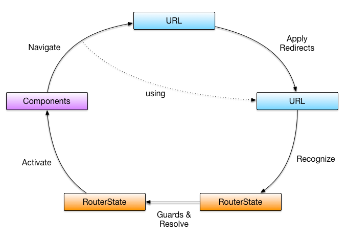
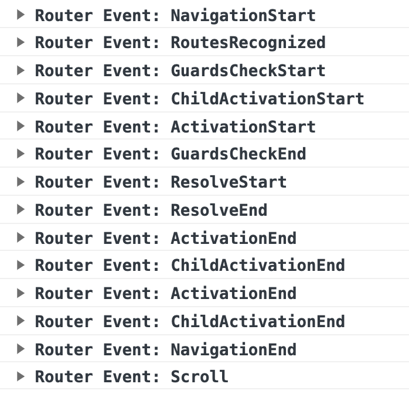

# Day #30: Angular Router - Guards and Resolvers



Angular consists of 5 basic operations when receiving an URL:

    1. Apply redirect
    2. Recognize router states
    3. Run guards and resolve data
    4. Activate all the needed components
    5. Manage navigation

`app-routing.module.ts`

```typescript
const routes: Routes = [
    {
        path: 'admin',
        loadChildren: () => 
            import('/admin/admin.module').then(m => m.AdminModule),
    },
    {
        path: '',
        redirectTo: 'article',
        pathMatch: 'full'
    }
];
```

`admin-routing.module.ts`

```typescript
const routes = Routes [
    {
        path: '',
        children: [
            {
                path: '',
                component: AdminArticleListComponent,
            }
        ]
    }
];
```

-   `Navigation`

    -   The `anchor` tag `href` default behavior will be making request to the URL
    -   `Angular Router` provides `routerLink` directive as substitute to perform `navigation` (declarative)
    -   Or, we can use `Router.navigate()` or `Router.navigateByUrl()` (imperative)

-   `Recognize router states`

    -   `Angular Router` will perform `Backtracking`, `Depth-first` to find out the most matching URL
    -   `RouterState` is returned containing data about activated route: component, params, data ...
    -   Then, `Angular Router` emits `RoutesRegconized` event

-   `Run guards`

    -   With `future router state`, `Router` will perform permission check for the target URL
    -   We can apply multiple `Guards`, `Router` will check if all `Guards` return `true` or `Promise<true>` or `Observable<true>` to grant permission, or reject when receiving `Promise<false>`, `Observable<false>` or `UrlTree`
    -   `Router` will emit `GuardsCheckStart` and `GuardsCheckEnd` events

-   `Resolve data`

    -   After performing `Guards`, `Router` will `resolve data`. At this time, we can `prefetch data` before `Router` render anything
    -   `Router` will emit `ResolveStart` and `ResolveEnd` events
    -   `Router` will then update parts of `resolvers` to the `data` property of `ActivatedRoute`
    -   Finally, `Router` will activate component to corresponding `router-outlet` predefined in the `config`

-   `Activating Components`

    -   `Router` will activate `components` linked with activated route (generating or resuse component then render them into `<router-outlet>`). The default behavior will be primary outlet, `<router-outlet>` without `name`

-   `Manage navigation`

    -   `Router` will now `observe` whether there is any request to change the URL to perform the cycle once again
    -   One guard can implement `CanActivate` and `CanActivateChild`, applied to both `app-routing.modules` and `article.routes` and will function correspondingly ( only `canActivate` will be executed in `app-routing.module`, only `canActivateChild` will be executed in `article-routes`)
    -   `CanActivateChild` will be applied for all `children`, not having to repeat code

    
 
    ```typescript
    @NgModel({
        imports: [RouterModule.forRoot(routes, { enableTracing: true })],
        // imports: [RouterModule.forRoot(routes, { enableTracing: !environment.production })],
        exports: [RouterModule]
    })
    ```

-   `Route Guards`

    -   `If all guards return true, navigation will continue, If any guards returns false, navigation will be cancelled. If any guards returns a UrlTree, current navigation will be cancelled and a new navigation will be kicked off to the UrlTree returned from the guard.`
    -   `Angular Router` provides some guards:
        -   Activate components:

        ```typescript
        interface CanActivate {
            canActivate(route: ActivateRouteSnapshot, state: RouterStateSnapshot): Observable<boolean | UrlTree | Promise<boolean | UrlTree> | boolean | UrlTree
        }
        ```

        ```typescript
        interface CanActivateChild {
            canActivateChild(childRoute: ActivateRouteSnapshot, state: RouterStateSnapshot): Observable<boolean | UrlTree> | Promise<boolean | UrlTree> | boolean | UrlTree
        }
        ```

        -   Deactivate components: 

        ```typescript
        interface CanDeactivate<T> {
            canDeactivate(component: T, currentRoute: ActivateRouteSnapshot, currentState: RouterStateSnapshot, nextState?: RouterStateSnapshot): Observable<boolean | UrlTree> | Promise<boolean | UrlTree> | boolean | UrlTree
        }
        ```

        -   Load children (lazy loading route):

        ```typescript
        interface CanLoad {
            canLoad(route: Route, segments: UrlSegment[]): Observable<boolean | UrlTree> | Promise<boolean | UrlTree> | boolean | UrlTree
        }
        ```

-   `CanActivate`

    -   Routing config that only the author of the post can edit

        ```typescript
        const routes: Routes = [
            {
                path: 'article',
                component: ArticleComponent,
                children: [
                    {
                        path: '',
                        component: ArticleListComponent,
                    },
                    {
                        path: ':slug',
                        component: ArticleDetailsComponent,
                    },
                    {
                        path: ':/slug/edit',
                        component: ArticleEditComponent
                    }
                ]
            }
        ];
        ```

    -   Create `service` to check for permission

        ```typescript
        @Injectable({
            provideIn: 'root' // change to any level if needed
        })
        
        export class CanEditArticleGuard implements CanActivate {
            canActivate(
                next: ActivatedRouteSnapshot,
                state: RouterStateSnapshot): Observable<boolean | UrlTree> | Promise<boolean | UrlTree> | boolean | UrlTree {
                    return true; // actual logic here
                }
            )
        }
        ```

    -   To register the `guard`, add it in `canActivate` array in routing config:

        ```typescript
        const routes: Routes = [
            {
                path: 'article',
                component: ArticleComponent,
                children: [
                    {
                        path: ':slug/edit',
                        component: ArticleEditComponent,
                        canActivate: [CanEditArticleGuard] // multiple guards is allowed
                    }
                ]
            }
        ];
        ```

    -   `service` to recognize the current user

        ```typescript
        @Injectable({
            provideIn: 'root'
        })
        
        export class UserService {
            currentUser = {
                username: 'Foo',
            };
            constructor() {}
        }
        ```

    -   `Guard`

        ```typescript
        @Injectable({
          providedIn: 'root'
        })
        export class CanEditArticleGuard implements CanActivate {
          constructor(private userService: UserService, private articleService: ArticleService) {}
          canActivate(
            next: ActivatedRouteSnapshot,
            state: RouterStateSnapshot): Observable<boolean | UrlTree> | Promise<boolean | UrlTree> | boolean | UrlTree {
            return this.articleService.getArticleBySlug(next.paramMap.get('slug')).pipe(
              map(article => article.author === this.userService.currentUser.username)
            );
          }
        }
        ```
